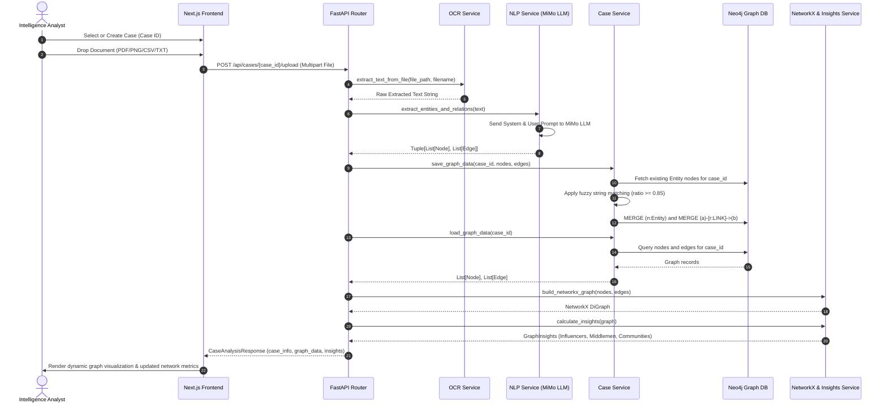

# AI-Powered Criminal Network Analysis Architecture

## 1. Overview & System Scope

The **AI-Powered Criminal Network Analysis Platform** is an intelligent investigative system built for law enforcement and intelligence analysts. It automates the extraction, resolution, and visualization of complex criminal networks from unstructured police documents, First Information Reports (FIRs), call detail records (CDRs), and image/PDF artifacts.

### Key Capabilities
- **Multi-Format Document Parsing**: Ingests PDFs, images (PNG, JPG, TIFF), CSVs, Excel spreadsheets, and plain text files.
- **Automated Intelligence Extraction**: Utilizes an LLM (MiMo LLM via OpenAI-compatible SDK) to perform Named Entity Recognition (NER) and Relationship Extraction specifically filtered to exclude administrative/police meta-data and isolate criminal entities (suspects, accomplices, vehicles, locations, phone numbers).
- **Fuzzy Entity Resolution**: Matches incoming entities with existing graph nodes using sequence string matching (difflib with $\ge 85\%$ threshold) to merge duplicates and prevent network fragmentation.
- **Graph Database Storage**: Persists persistent multi-case graph networks in Neo4j using Cypher queries.
- **Graph Analytics & Insights**: Runs NetworkX-backed Graph Theory algorithms to identify top influencers (Degree Centrality), key bridges/middlemen (Betweenness Centrality), and sub-gang clusters (Greedy Modularity Community Detection).
- **Interactive Visual Explorer**: Next.js-based dynamic interface offering D3 force-directed network graphs, case selection, entity detail inspection, floating file dropzone, and real-time analytical metrics.

---

## 2. High-Level System Architecture

```mermaid
flowchart TB
    subgraph Frontend["Frontend Layer (Next.js 16 + React 19)"]
        UI[User Interface / Toolbar]
        CaseMgmt[Case Sidebar Component]
        Dropzone[FileUpload Overlay / Dropzone]
        GraphView[Network Graph Component - D3 Force]
        InsightsPanel[SidePanel Insights & Entity Inspector]
        APIClient[Axios Client - /lib/api.js]
    end

    subgraph Backend["Backend Layer (FastAPI)"]
        Router[API Router - /app/api/routes.py]
        
        subgraph Services["Core Application Services"]
            OCR[OCR Service\n(pdfplumber, pytesseract, pandas)]
            NLP[NLP Service\n(MiMo LLM / OpenAI API)]
            CaseSvc[Case & Graph Service\n(Fuzzy Matching / Cypher Builder)]
            GraphSvc[Graph Service\n(NetworkX Builder)]
            InsightsSvc[Insights Service\n(Centrality & Communities)]
        end
    end

    subgraph Persistence["Storage Layer"]
        Neo4j[(Neo4j Graph Database)]
        LLM[MiMo LLM Service\nhttps://api.xiaomimimo.com]
    end

    Dropzone -->|Upload File POST| Router
    CaseMgmt -->|List/Select Cases GET| Router
    Router -->|1. Raw File| OCR
    OCR -->|Extracted Text| NLP
    NLP -->|Extract Entities & Edges| LLM
    LLM -->|JSON Schema| NLP
    NLP -->|Nodes & Edges| CaseSvc
    CaseSvc -->|Fuzzy Match & Persist| Neo4j
    Router -->|2. Query Graph| CaseSvc
    CaseSvc -->|Nodes & Edges| GraphSvc
    GraphSvc -->|NetworkX DiGraph| InsightsSvc
    GraphSvc -->|GraphData| Router
    InsightsSvc -->|GraphInsights| Router
    Router -->|CaseAnalysisResponse| APIClient
    APIClient --> GraphView
    APIClient --> InsightsPanel
```

---

## 3. End-to-End Workflow



---

## 4. Backend System Architecture

### 4.1 Component Breakdown

1. **API Layer ([routes.py](file:///c:/Users/chyav/Documents/sih26-demo/backend/app/api/routes.py))**
   - Implements endpoints for case management (`POST /api/cases`, `GET /api/cases`, `GET /api/cases/{case_id}`) and document ingestion (`POST /api/cases/{case_id}/upload`).
   - Manages temporary file lifecycle during file upload processing.

2. **OCR Service ([ocr_service.py](file:///c:/Users/chyav/Documents/sih26-demo/backend/app/services/ocr_service.py))**
   - Delegates file parsing based on extension:
     - `.pdf`: Parsed via `pdfplumber` page-by-page text extraction.
     - `.png`, `.jpg`, `.jpeg`, `.tiff`: Processed via `pytesseract` OCR image-to-string.
     - `.csv`, `.xls`, `.xlsx`: Extracted using `pandas` tabular string conversions.
     - `.txt`: Plain text UTF-8 reader.

3. **NLP Extraction Service ([nlp_service.py](file:///c:/Users/chyav/Documents/sih26-demo/backend/app/services/nlp_service.py))**
   - Interacts with MiMo LLM (`mimo-v2.5` model) via the OpenAI SDK.
   - Enforces structured JSON output (`response_format={"type": "json_object"}`).
   - Filters out administrative boilerplate and police personnel, extracting strictly core crime entities: `PERSON`, `ORG`, `LOCATION`, `PHONE`, `VEHICLE_PLATE`, and semantic relationships (`ACCOMPLICE_OF`, `OWNS_VEHICLE`, `CALLED`, `ARRESTED_AT`).

4. **Case & Entity Resolution Service ([case_service.py](file:///c:/Users/chyav/Documents/sih26-demo/backend/app/services/case_service.py))**
   - Connects to Neo4j via singleton driver ([neo4j_client.py](file:///c:/Users/chyav/Documents/sih26-demo/backend/app/db/neo4j_client.py)).
   - Executes fuzzy match comparison (`difflib.SequenceMatcher`) against existing entities in the same case using a similarity ratio cutoff of `0.85`.
   - Normalizes node IDs and maps edge sources/targets to prevent entity duplication.
   - Persists nodes as `MERGE (n:Entity {id, case_id})` and edges as `MERGE (a)-[r:LINK {case_id, type}]->(b)`. Cumulative links increment the edge `weight`.

5. **Graph Analytics & Insights Service ([graph_service.py](file:///c:/Users/chyav/Documents/sih26-demo/backend/app/services/graph_service.py) & [insights_service.py](file:///c:/Users/chyav/Documents/sih26-demo/backend/app/services/insights_service.py))**
   - Converts raw database node/edge tuples into a NetworkX Directed Graph (`DiGraph`).
   - **Degree Centrality**: Ranks top influencers based on connectivity score.
   - **Betweenness Centrality**: Pinpoints critical bottlenecks/middlemen bridging disjoint graph segments.
   - **Community Detection**: Applies `greedy_modularity_communities` on undirected graph projections to uncover potential sub-gangs or criminal sub-clusters.

---

## 5. Frontend System Architecture

### 5.1 Component Breakdown

1. **Page Orchestrator ([page.jsx](file:///c:/Users/chyav/Documents/sih26-demo/frontend/app/page.jsx))**
   - Maintains active state (`activeCaseId`, `caseInfo`, `graphData`, `insights`, `selectedNode`, `error`).
   - Coordinates cross-component communication between the Case Sidebar, Header Toolbar, Graph Canvas, File Upload Modal, and Insights Side Panel.

2. **Case Management Sidebar ([CaseSidebar.jsx](file:///c:/Users/chyav/Documents/sih26-demo/frontend/app/components/CaseSidebar.jsx))**
   - Renders available cases, allows creation of new investigation cases, and highlights the currently active case.

3. **Network Graph Canvas ([NetworkGraph.jsx](file:///c:/Users/chyav/Documents/sih26-demo/frontend/app/components/NetworkGraph.jsx))**
   - Interactive force-directed layout visualization powered by `d3-force` and SVG or Canvas rendering.
   - Handles zoom/pan controls, node selection, edge labeling, and color coding by entity type (`PERSON`, `PHONE`, `LOCATION`, `VEHICLE_PLATE`, `ORG`).

4. **File Upload Overlay ([FileUpload.jsx](file:///c:/Users/chyav/Documents/sih26-demo/frontend/app/components/FileUpload.jsx))**
   - Floating drag-and-drop dropzone powered by `react-dropzone`. Accepts multi-format evidence files and triggers instant analysis updates.

5. **Insights & Entity Inspector ([SidePanel.jsx](file:///c:/Users/chyav/Documents/sih26-demo/frontend/app/components/SidePanel.jsx))**
   - Displays real-time intelligence telemetry:
     - Entity details when a node is clicked.
     - Top Influencers list with centrality scores.
     - Key Middlemen / Bridge entities.
     - Detected Sub-gang Communities and member breakdowns.

6. **API Client Layer ([api.js](file:///c:/Users/chyav/Documents/sih26-demo/frontend/lib/api.js))**
   - Axios client configured for target backend base URL (`http://localhost:8000/api`).

---

## 6. Data Schema & Contracts

### 6.1 Database Schema (Neo4j Graph)

- **Nodes**:
  - `(:Case {id: STRING, name: STRING, description: STRING, created_at: DATETIME})`
  - `(:Entity {id: STRING, case_id: STRING, label: STRING, type: STRING, metadata: STRING})`

- **Relationships**:
  - `(:Entity)-[:LINK {case_id: STRING, type: STRING, weight: FLOAT}]->(:Entity)`

### 6.2 Pydantic Schemas ([schemas.py](file:///c:/Users/chyav/Documents/sih26-demo/backend/app/models/schemas.py))

```python
class Node(BaseModel):
    id: str
    label: str
    type: str
    metadata: Dict[str, Any] = {}

class Edge(BaseModel):
    source: str
    target: str
    relation: str
    weight: float = 1.0

class GraphData(BaseModel):
    nodes: List[Node]
    edges: List[Edge]

class GraphInsights(BaseModel):
    top_influencers: List[Dict[str, Any]] = []
    key_middlemen: List[Dict[str, Any]] = []
    communities: List[Dict[str, Any]] = []
    stats: Dict[str, Any] = {}

class CaseResponse(BaseModel):
    id: str
    name: str
    description: str
    created_at: Optional[Any] = None

class CaseAnalysisResponse(BaseModel):
    case_info: CaseResponse
    graph_data: GraphData
    insights: GraphInsights
```

---

## 7. Technology Stack Summary

| Layer | Technology | Key Libraries / Frameworks |
| :--- | :--- | :--- |
| **Frontend UI** | Next.js 16 (App Router), React 19 | Tailwind CSS v4, Lucide React, Framer Motion |
| **Graph & Dropzone** | Visualizations | D3-force, React-Dropzone, React-Zoom-Pan-Pinch |
| **HTTP Client** | Axios | RESTful communications with FastAPI |
| **Backend Framework** | FastAPI (Python 3.10+) | Uvicorn ASGI Server, Pydantic v2 |
| **OCR & Document Ingestion** | OCR Services | pdfplumber, pytesseract, PIL, pandas, openpyxl |
| **AI / NLP Extraction** | OpenAI Python SDK | MiMo LLM (`mimo-v2.5`), Custom Prompting |
| **Graph Analytics** | NetworkX | Degree Centrality, Betweenness Centrality, Greedy Modularity |
| **Graph Database** | Neo4j | Neo4j Python Driver, Cypher Query Language |

---

## 8. Development & Deployment Operational Setup

1. **Environment Configuration**:
   - Backend `.env`:
     ```env
     NEO4J_URI=bolt://localhost:7687
     NEO4J_USER=neo4j
     NEO4J_PASSWORD=password
     MIMO_API_KEY=your_mimo_api_key
     ```
2. **Running Backend**:
   ```bash
   cd backend
   pip install -r requirements.txt
   uvicorn app.main:app --reload --port 8000
   ```
3. **Running Frontend**:
   ```bash
   cd frontend
   npm install
   npm run dev
   ```
